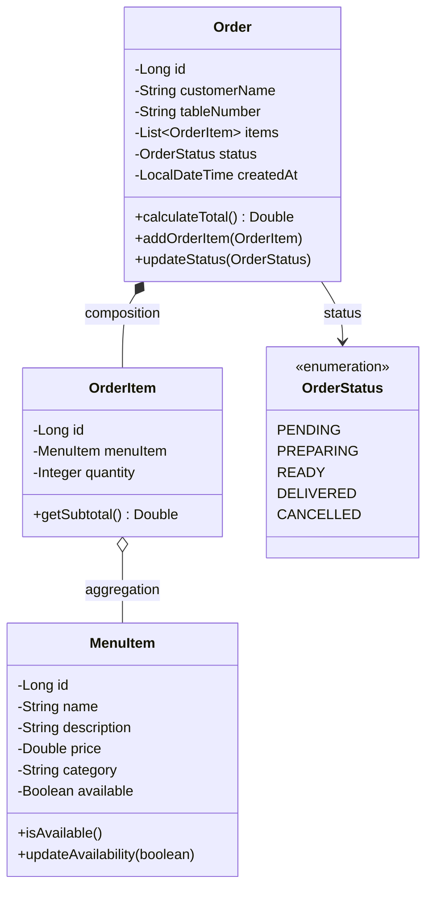
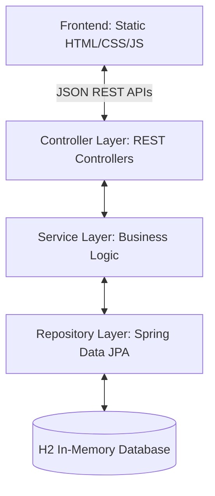

# Restaurant Order System (MC322 Final Project)

A clean, object-oriented Java backend with a dynamic HTML/CSS/JS frontend that allows customers to place orders from their tables, and managers to handle the orders and customize the menu.

---

1. **Project Overview & User Flows**

1. **Customer Flow (No Login):**
   - Accesses the customer view (e.g., `/index.html?table=4`).
   - System automatically extracts the `tableNumber` from the URL query parameter (or prompts the user if missing).
   - Customer enters their name.
   - Browses menu categories, adds items to a shopping cart.
   - Reviews the cart (overview) and submits the order.

2. **Admin/Manager Flow:**
   - Gains access to the Manager Dashboard:
     - **Order Tracking:** View all active orders, filter by status, and change order status (e.g., `PENDING` -> `PREPARING` -> `READY` -> `DELIVERED`).
     - **Menu Editor:** Create, edit, toggle availability, or delete menu items.
     - **Order Creation:** Create a new order directly on behalf of any table.

---

## 2. OOP Class Design (Domain Entities)

The system uses strong OOP principles such as encapsulation, composition, and aggregation.



- **Encapsulation:** Private variables are accessed via public getters/setters.
- **Composition:** An Order owns its list of OrderItems. If an order is deleted, its items are removed (cascade operations).
- **Aggregation:** OrderItem references a MenuItem. The item continues to exist even if the order item is deleted.

---

## 3. High-Level Architecture (Layered Architecture)

We use a classic Layered Web Architecture:



### Components per Package

- **model:** Standard JPA entities (Order, OrderItem, MenuItem, OrderStatus).
- **repository:** Spring Data JPA repositories extending JpaRepository for data access.
- **service:**
  - MenuService: Handles listing, adding, and updating menu items.
  - OrderService: Manages business logic of creating orders, checking item availability, calculating total prices, and state changes.
- **controller:**
  - MenuController: Handles public menu fetching, and menu modifications.
  - OrderController: Handles public order placement, and order management.

---

## 4. API Endpoints

### Public Endpoints (Accessible by Customers)

- `GET /api/menu` - Fetch list of active/available menu items.
- `POST /api/orders` - Place a new order.
  - Body:
    ```json
    {
      "customerName": "Mariana",
      "tableNumber": "12",
      "items": [
        { "menuItemId": 1, "quantity": 2 },
        { "menuItemId": 3, "quantity": 1 }
      ]
    }
    ```

### Admin Endpoints

- `GET /api/orders` - Fetch all orders (with filters like status).
- `PUT /api/orders/{id}/status` - Advance/change order status.
- `POST /api/orders` - Admins can also create new orders (same as public).
- `POST /api/menu` - Create menu item.
- `PUT /api/menu/{id}` - Edit menu item.
- `DELETE /api/menu/{id}` - Delete menu item.

---

## 5. Technology Stack & Database Strategy

1. **Build Tool:** Maven (`pom.xml` with parent `spring-boot-starter-parent`).
2. **Java Version:** Java 17+
3. **ORM / Database:** Spring Data JPA (Hibernate) mapping to an **H2 In-Memory Database**.
   - H2 runs in memory, so restarting the app clears the data.
   - To keep it usable, we will seed default menu items (e.g. Hamburger, Soda) on startup.
   - We will enable `/h2-console` for easy grading visualization.
4. **Frontend Integration:** All HTML/CSS/JS files will reside in `src/main/resources/static/`. Spring Boot will serve them automatically at `localhost:8080/`.

# Contribution Conventions:

1. Always push the main to your branch before a pull request.
  - This will prevent merge conflicts and make sure the main will work after your pull request.

2. Every pull request must be aproved by at least one other team member before being merged.
  - This will help ensure good code, prevent bugs and improve the team communication

3. Be clear on what you are doing.
  - Help the other team members know what you are doing. 
  - It will help if your commits message are clear and the pull requests too.
  - Try to modify as little as possible in your final pull request.
   - For example: It's not a good practice to open a pull request that changes a .css file button collor, from the frontend and at the same time, changing how an order calculates it's total.

