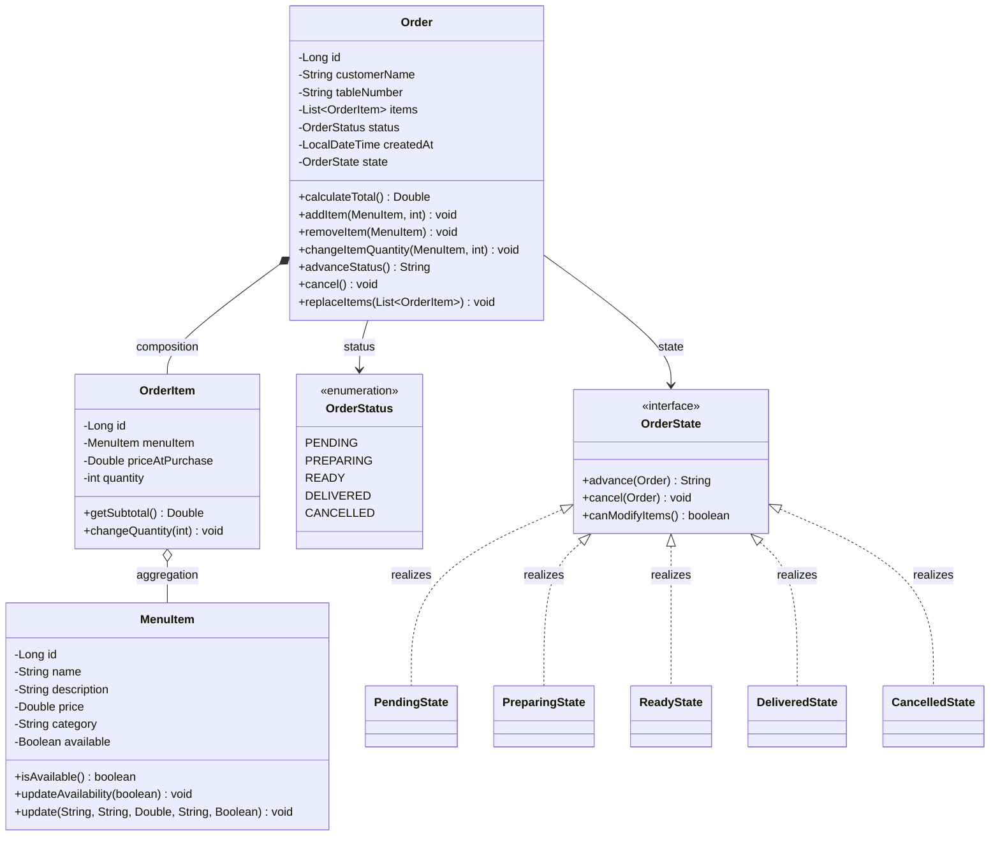
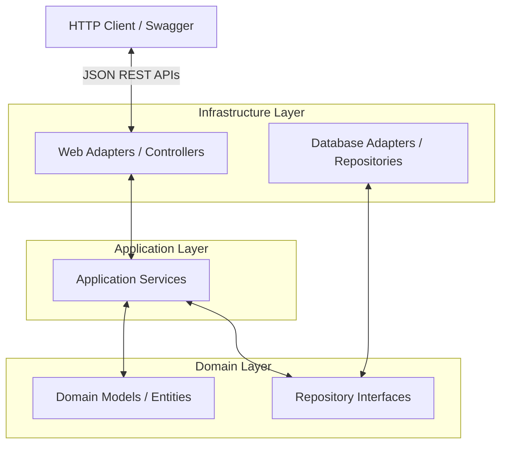

# Restaurant Order System (MC322 Final Project)

A clean, object-oriented Java backend REST API designed with Clean Architecture principles. The system allows customers to view the menu and place orders, and managers to track/update order statuses and customize the menu.

---

## 1. Project Overview & Security Model

### Pure Backend REST API
This repository contains the backend REST API for the Restaurant Order System. It does not include a frontend web client; all interactions are performed via HTTP requests (e.g., using Swagger UI, HTTP client files, or `curl`).

### No-Auth Security Model
To simplify testing, local development, and grading, the system operates in a **"No Auth" (public access)** configuration:
- There is no login, session, or token validation.
- All HTTP endpoints are publicly accessible.
- This includes administrative actions (e.g., modifying the menu via `POST /api/menu` or advancing order statuses via `PUT /api/orders/{id}/status`).

---

## 2. OOP Class Design (Domain Layer & State Pattern)

The system enforces strict object-oriented design patterns, encapsulation, and contract principles (LSP, Demeter, Tell Don't Ask).



- **Encapsulation (Logical Shielding):** Private variables are heavily protected. Public setters that compromise class invariants (like `setId()`, `setStatus()`, or `setCreatedAt()`) do not exist. Any mutation is triggered through domain-intent methods (`addItem`, `removeItem`, `advanceStatus`, `cancel`). Structural collections are returned as unmodifiable lists (`Collections.unmodifiableList`) to prevent direct list manipulation.
- **State Design Pattern:** Order lifecycle transitions are managed polymorphically through concrete state classes implementing the `OrderState` interface, replacing procedural `if-else` flows and upholding the Open/Closed Principle.
- **Composition:** An `Order` owns its list of `OrderItem` instances. Deleting an order cascades and removes its items.
- **Aggregation:** `OrderItem` references a `MenuItem`. The menu item exists independently of any individual order and captures `priceAtPurchase` to preserve historical order receipts.

---

## 3. High-Level Architecture (Clean Architecture)

The codebase is organized following Clean Architecture principles to decouple the core business domain from external framework and database details:



### Package Layout
- **`ros.domain`**: The core domain layer. Free from Spring Framework or JPA annotations. Contains pure domain entities (`Order`, `MenuItem`, `OrderItem`), exceptions, the State Pattern implementation, and interfaces (`OrderRepository`, `MenuItemRepository`).
- **`ros.application`**: Coordinates application use cases. Contains DTO classes (`MenuItemRequest`, `OrderCreationRequest`), custom application exceptions, and application services (`OrderApplicationService`, `MenuApplicationService`).
- **`ros.infrastructure`**: Deals with configuration and framework infrastructure.
  - `web`: REST Controllers exposing the endpoints, along with the `GlobalExceptionHandler` mapping domain/application errors into HTTP 4xx statuses.
  - `persistence`: JPA Database entities (`OrderEntity`, `MenuItemEntity`, `OrderItemEntity`) and standard Spring Data JpaRepositories.
  - `repository`: Implementation of domain repository interfaces adapting the JPA repositories using type-safe generics mapping (`Mapper<D, E>`).
  - `config`: Setup classes, including `DatabaseSeeder` which populates H2 on startup with mock data.

---

## 4. Running the Application & Tests

### Prerequisites
- Java 17 or higher
- Maven 3.6+

### Build & Run
Run the application using Maven:
```bash
mvn clean spring-boot:run
```

### Running Tests
Execute the comprehensive automated test suite (53 unit/integration tests covering the web, service, and domain state machine layers):
```bash
mvn test
```

### H2 Database Console
- **URL:** `http://localhost:8080/h2-console`
- **JDBC URL:** `jdbc:h2:mem:restaurantdb`
- **Username:** `sa`
- **Password:** *(leave empty)*

### Swagger API Documentation
Interactive API docs are auto-generated via SpringDoc:
- **URL:** `http://localhost:8080/swagger-ui/index.html`

---

## 5. Manual Testing & Oral Defense Guide

A complete manual test suite has been prepared under the `/manual-tests` folder to verify the API's robustness and error handling during oral evaluation.

- **[api-tests.http](file:///home/luizdomingues/Desktop/mc322/projeto_final/manual-tests/api-tests.http)**: An interactive HTTP client script containing Happy and Sad path queries that can be run directly inside VS Code (using the *REST Client* extension) or IntelliJ.
- **[README.md (Defense Script)](file:///home/luizdomingues/Desktop/mc322/projeto_final/manual-tests/README.md)**: A step-by-step walkthrough script for the oral presentation, demonstrating:
  1. Fail-fast domain validations.
  2. The State Design Pattern preventing illegal order operations (e.g. updating items in prepared orders).
  3. Proper HTTP 4xx mapping for domain errors (such as duplicate items or double-cancellations).

---

## 6. Contribution Conventions
1. **Sync with Main:** Always pull the latest `main` branch to your branch before opening a pull request.
2. **Review & Approval:** Every pull request must be approved by at least one other team member before merging.
3. **Commit Clarity:** Write clear commit messages and keep pull requests highly focused.
