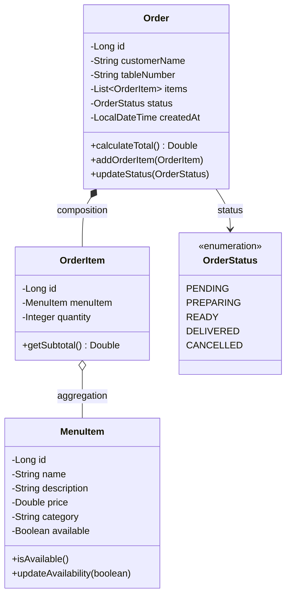
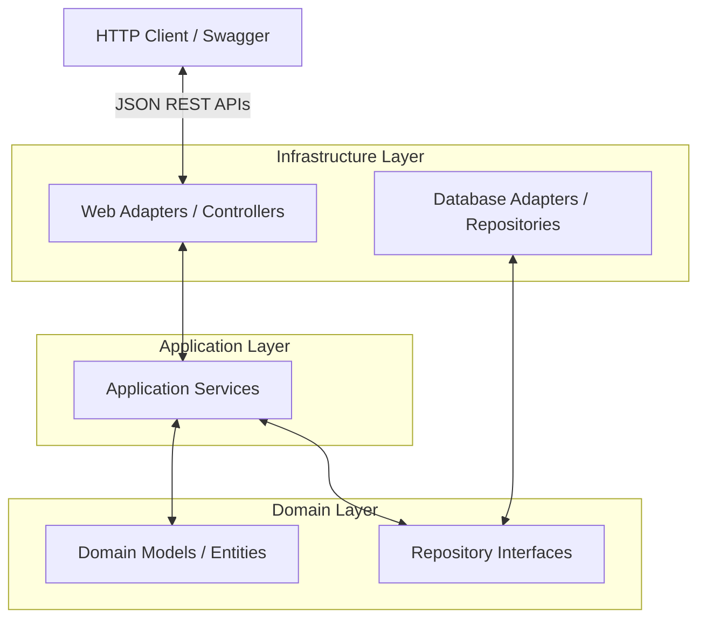

# Restaurant Order System (MC322 Final Project)

A clean, object-oriented Java backend REST API designed with Hexagonal Architecture/Clean Architecture principles. The system allows customers to view the menu and place orders, and managers to track/update order statuses and customize the menu.

---

## 1. Project Overview & Security Model

### Pure Backend REST API
This repository contains the backend REST API for the Restaurant Order System. It does not include a frontend web client; all interactions are performed via HTTP requests (e.g., using Swagger UI, Postman, or `curl`).

### No-Auth Security Model
To simplify testing, local development, and grading, the system operates in a **"No Auth" (public access)** configuration:
- There is no login, session, or token validation.
- All HTTP endpoints are publicly accessible.
- This includes administrative actions (e.g., modifying the menu via `POST /api/menu` or advancing order statuses via `PUT /api/orders/{id}/status`).

---

## 2. OOP Class Design (Domain Entities)

The system uses strong OOP principles such as encapsulation, composition, and aggregation.



- **Encapsulation:** Private variables are accessed via public getters/setters.
- **Composition:** An `Order` owns its list of `OrderItem` instances. Deleting an order cascades and removes its items.
- **Aggregation:** `OrderItem` references a `MenuItem`. The menu item exists independently of any individual order.

---

## 3. High-Level Architecture (Hexagonal / Clean Architecture)

The codebase is organized following Hexagonal Architecture principles to decouple the core business domain from external framework details:



### Package Layout
- **`ros.domain`:** The core domain layer. Free from Spring Framework or JPA annotations. Contains pure domain entities (`Order`, `MenuItem`, `OrderItem`), exceptions, and interfaces (`OrderRepository`, `MenuRepository`).
- **`ros.application`:** Coordinates application use cases. Contains DTO classes (`MenuItemRequest`, `OrderCreationRequest`) and application services (`OrderApplicationService`, `MenuApplicationService`).
- **`ros.infrastructure`:** Deals with configuration and infrastructure details.
  - `web`: REST Controllers exposing the endpoints.
  - `persistence`: JPA Database entities (`OrderEntity`, `MenuItemEntity`, `OrderItemEntity`) and standard Spring Data JpaRepositories.
  - `repository`: Implementation of domain repository interfaces adapting the JPA repositories.
  - `config`: Setup classes, including `DatabaseSeeder` which populates H2 on startup with mock data.

---

## 4. Running the Application

### Prerequisites
- Java 17 or higher
- Maven 3.6+

### Build & Run
Run the application using Maven:
```bash
mvn clean spring-boot:run
```

### H2 Database Console
- **URL:** `http://localhost:8080/h2-console`
- **Driver Class:** `org.h2.Driver`
- **JDBC URL:** `jdbc:h2:mem:restaurantdb`
- **Username:** `sa`
- **Password:** *(leave empty)*

### Swagger API Documentation
Interactive API docs are auto-generated via SpringDoc:
- **URL:** `http://localhost:8080/swagger-ui/index.html`

---

## 5. API Endpoints

### Menu Endpoints
- `GET /api/menu` - Fetch list of active/available menu items.
- `POST /api/menu` - Create a new menu item.
- `PUT /api/menu/{id}` - Edit a menu item.
- `DELETE /api/menu/{id}` - Delete a menu item.

### Order Endpoints
- `GET /api/orders` - Fetch all orders (supports filtering by `statuses`, `fromDate`, `toDate`, and `minValue`).
- `POST /api/orders` - Place a new order.
- `PUT /api/orders/{id}/status` - Advance order status to the next step (`PENDING` -> `PREPARING` -> `READY` -> `DELIVERED`).

---

## 6. Contribution Conventions
1. **Sync with Main:** Always pull the latest `main` branch to your branch before opening a pull request.
2. **Review & Approval:** Every pull request must be approved by at least one other team member before merging.
3. **Commit Clarity:** Write clear commit messages and keep pull requests highly focused.
